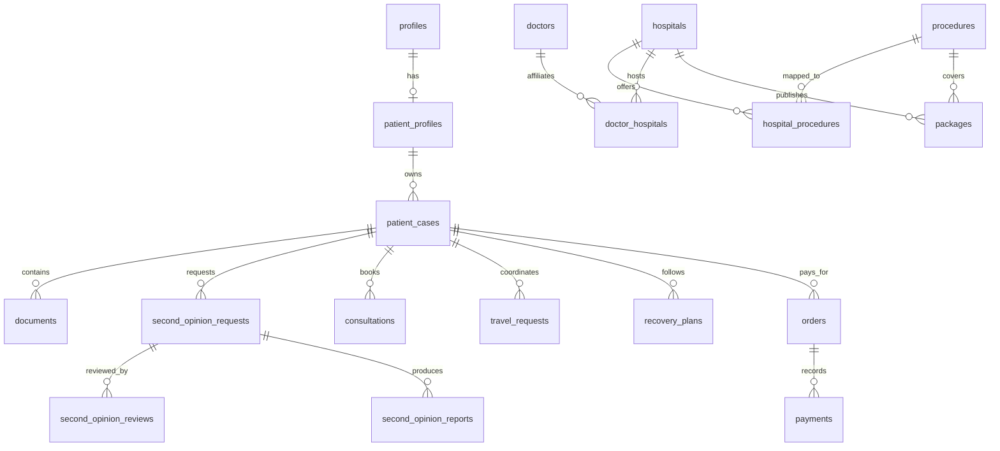

# Data model and trust boundaries

The implemented foundation is in `supabase/migrations/`: 35 PostgreSQL tables, two lifecycle enums, directory search, source records, and RLS. `supabase/seed.sql` adds explicitly synthetic discovery data. The current catalog uses `treatments`, `hospital_doctors`, `price_estimates`, `packages`, and related join tables; estimates are numeric ranges with currency and provenance. Profiles, cases, memberships, consent events, document metadata, agent execution, workflows, and audit events are persistence foundations only. Patient data is private by default. The sections below describe future extensions and should not be read as tables already deployed.

## Implemented access model

- Public directory reads require publication status; real provider records also require verified status. Synthetic records stay visibly labeled.
- A profile belongs to its Supabase Auth user. Cases are readable by owners and active caregivers/authorized family members; only owners can add or revoke members.
- Consent events are append-only for the subject. Documents and case history are readable by authorized case members. Agent execution, workflow internals, source records, and audit events have no direct patient mutation grant.
- External or first-party catalog records require a source record. `source_records` captures source name, URL/identifier, retrieval date, extraction method, verification and validity metadata.

## Implemented coordination planning

Migration `20260930090000_care_planning.sql` adds `care_plans` and `care_plan_tasks`. These are nonclinical coordination records, not clinician-approved treatment instructions. One plan belongs to one owned conversation; a composite foreign key prevents a mismatched owner. Treatment/destination references use existing catalog tables. Structured context stores stated preferences; sourced findings keep record IDs, source kind, match reasons, and retrieval times.

Task keys are unique within a plan. Tasks distinguish discovery, user review/preferences, required clarification, and an unimplemented external approval boundary. `agent_runs.care_plan_id` and `agent_tasks.care_plan_task_id` connect plans to existing actions/outputs; triggers enforce matching plan/conversation/task scope. No direct patient writes are granted. Owner reads use RLS and inherit current case access from the conversation. Service-only lease/save RPCs serialize turns and save plan/task changes atomically.

## Future extensions

## Identity and access

| Entity | Key relationships and constraints |
|---|---|
| `profiles` | `id = auth.users.id`; public-safe name, locale, timezone; no clinical record fields. |
| `patient_profiles` | One-to-one `profiles`; demographics kept separate with limited access. A patient can have many cases. |
| `organization_memberships` | User, organization, role, active dates. Covers provider staff, coordinators, reviewers and admins without duplicate user tables. |
| `caregiver_grants` | Patient, caregiver profile, scope, expiry and revocation; required for proxy access. |
| `consents` | Patient, purpose, policy version, granted/revoked timestamps, actor and evidence reference. Consent events are append-only; current status derived. |

## Catalog and locations

| Entity | Key relationships and constraints |
|---|---|
| `countries`, `cities` | ISO country code unique; city belongs to country; alternate names/search aliases may be separate. |
| `specialties`, `conditions`, `symptoms`, `procedures` | Controlled taxonomies with stable code, reviewed label, aliases and publication status. A `treatment` is a patient-facing content concept linked to a procedure or condition rather than a duplicate of it. |
| `content_items` | Type, slug, locale, body/structured sections, clinical reviewer, review date, publish state and version. Links to taxonomy via `content_relations`. |
| `hospitals` | Provider organization, location, published status, last verification date. Facilities can be structured only when filterable. |
| `hospital_accreditations` | Hospital, issuer, scope, credential, issue/expiry dates, verification source and evidence file; never a naked badge. |
| `hospital_specialties`, `hospital_procedures` | Many-to-many joins with verification state. |
| `doctors` | Provider profile/identity distinct from user login; display data, verification status and last checked date. |
| `doctor_specialties`, `doctor_hospitals`, `doctor_procedures`, `doctor_languages` | Many-to-many joins, dated affiliations where relevant; doctor credentials/experience in separately versioned evidence records. |
| `treatment_cost_observations` | Procedure + provider or country, amount/range, currency, inclusions basis, valid date, source and verifier. A country average is a computed view, not a competing mutable fact. |
| `packages`, `package_items` | Package version, hospital, procedure, optional clinician, validity, offer state, currency/amount; `package_items.kind` is inclusion/exclusion/optional. Separate item tables are unnecessary. |

## Patient case and clinical review

| Entity | Key relationships and constraints |
|---|---|
| `patient_cases` | Patient, service type, owner membership, stage, next actor and due date. A patient may have many cases; each case has many event records. |
| `case_conditions`, `case_symptoms`, `case_procedures` | Case-to-taxonomy joins with patient-reported/record-derived/clinician-verified provenance. Avoid free text being silently promoted to diagnosis. |
| `case_histories`, `case_preferences` | Versioned structured data and preferred destinations, budget, language; sensitive. |
| `documents` | Storage path, owner/case, MIME, size, checksum, scan status, DICOM metadata pointer, classification, uploader and retention. Object bytes live in private Storage, never PostgreSQL. `case_documents` is a join only if a document can belong to multiple cases; otherwise `documents.case_id` suffices. |
| `case_summaries`, `case_recommendations` | Versioned drafts, source document IDs, generator/model, validation state and professional reviewer; AI output never overwrites source facts. |
| `second_opinion_services`, `second_opinion_requests`, `second_opinion_reviews`, `second_opinion_reports` | Service catalog; request belongs to case; reviews belong to request and reviewer; report has version, signed artifact and release timestamp. A separate `second_opinion_cases` duplicates `patient_cases`, so use a subtype request table. |

## Booking, travel, recovery and commerce

| Entity | Key relationships and constraints |
|---|---|
| `consultation_services`, `consultation_slots`, `consultations` | Doctor/service, timezone-normalized slot, hold/booking state, patient case, video reference and clinician notes. A separate request table is needed only if asynchronous review precedes booking. |
| `travel_requests` | Case, type, current state, assigned owner. Type-specific `visa_requests`, `flight_requests`, `accommodation_requests`, `transport_requests` hold only distinct fields; common data stays in parent. |
| `recovery_plans`, `recovery_tasks`, `recovery_checkins`, `recovery_followups` | Plan belongs to case and clinician approver; tasks and check-ins dated; follow-ups reference appointments when applicable. |
| `orders`, `payments`, `refunds`, `invoices` | Order belongs to case/service or package version; payment/refund events have provider IDs, idempotency keys and reconciliation state. Invoice is a frozen legal artifact. Never store card data. |
| `notifications`, `conversations`, `messages` | Notification recipient and delivery state; conversation case scope; messages immutable with sender role and attachments. |

## AI and audit

| Entity | Key relationships and constraints |
|---|---|
| `ai_conversations`, `ai_messages` | Patient or staff context, case scope, redaction policy and retention; not a replacement for case facts. |
| `ai_runs`, `ai_tool_calls` | Agent, model/provider/version, prompt template version, actor, purpose, input/output hashes, tool schema version, result/status/latency and trace ID. Raw sensitive payloads have restricted storage/retention. |
| `ai_recommendations`, `ai_feedback` | Candidate references, deterministic score components, evidence, reviewer decision and feedback. |
| `audit_events`, `data_access_events` | Append-only actor/action/subject/reason/time/request ID; access to private documents and exports logged. Separate security tables only if retention/control policies differ. |

## Relationship sketch

## Access, integrity and retention

- Enable RLS before patient tables are exposed. Patient sees own records; caregiver sees only explicit grant scope; assigned staff sees only case tasks; clinician sees assigned clinical material; finance sees billing metadata, not clinical documents. Server service role is never sent to the browser.
- Use short-lived signed URLs for private objects, malware scanning, MIME validation, size limits, audit on read/download, and DICOM de-identification policy before processing.
- Use database transactions for status transitions, outbox events for notifications, webhook signature verification and idempotency for payment/booking callbacks.
- Use source provenance and review expiry for medical content, provider claims and price observations. Historical versions remain available to audit staff even after publication changes.
- Define region, retention, deletion/legal hold, backups and incident process with legal/security review before handling real patient data. Do not claim HIPAA/GDPR compliance merely from choosing Supabase.
